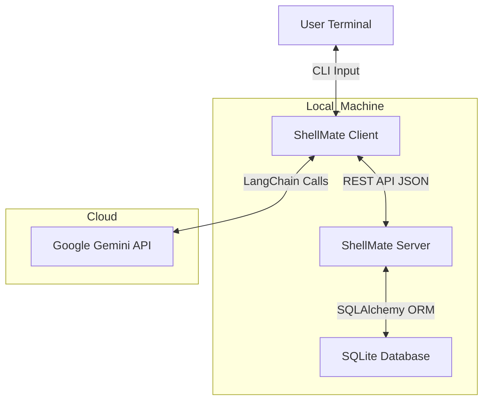

# [ShellMate 🐚](https://shushanth101.github.io/ShellMate-/)

> **Your Advanced AI CLI Companion**
>
> *Code smarter, manage projects faster, and never lose a thought with persistent memory.*

ShellMate is a powerful, terminal-based AI assistant built with a **Client-Server architecture**. Unlike standard CLI wrappers, ShellMate securely manages user sessions, persists long-term memories, and handles complex multi-turn conversations with context awareness. It integrates directly with your local environment to help you execute commands, manage files, and debug code effectively.

---

## ✨ Key Features

- **🧠 Persistent Memory**: ShellMate "remembers" facts about you and your projects across different sessions using a dedicated database.
- **🔐 User Authentication**: Secure generic **Signup** and **Login** flows with password hashing (bcrypt) ensure your chat history and data remain private.
- **📂 Client-Server Architecture**:
    -   **Server**: A Flask-based backend handles database interactions (SQLite), user management, and state persistence.
    -   **Client**: A rich Python CLI acts as the interface, communicating with the server via a REST API.
- **💬 Chat History Management**:
    -   **Save Chats**: ongoing conversations can be saved with AI-generated titles.
    -   **Resume Chats**: Browse and pick up right where you left off.
- **🛠️ Powerful Tools**:
    -   **System Interaction**: Execute shell commands safely.
    -   **File Operations**: Read, write, and edit files.
    -   **Web Search**: Fetch real-time information.
    -   **Python REPL**: Run code snippets for quick calculations or logic testing.
- **🎨 Rich Usage Interface**: A beautiful terminal UI powered by `rich` and `termcolor` featuring gradient banners, colored role differentiation, and clean output.

---

## 🏗️ Architecture



---

## 🚀 Installation

### Prerequisites
- **Python 3.8+**
- A **Google Gemini API Key**

### Setup

1.  **Clone the Repository**
    ```bash
    git clone -b v3.1 https://github.com/Shushanth101/ShellMate-.git
    cd ShellMate-
    ```

2.  **Create a Virtual Environment** (Recommended)
    ```bash
    python -m venv venv
    # Windows
    venv\Scripts\activate
    # macOS/Linux
    source venv/bin/activate
    ```

3.  **Install Dependencies**
    ```bash
    pip install -r src/requirements.txt
    ```

4.  **Configure Environment Variables**
    Create a `.env` file in the root directory:
    ```env
    GEMINI_API_KEY=your_actual_api_key_here
    ```

---

## 📖 Usage

Start the application by running the main client script. The server will be started automatically in the background.

```bash
python src/main.py
```

### Authentication
ShellMate supports multiple users. You can handle auth via the interactive menu or CLI flags.

-   **Interactive Mode**: Just run `python src/main.py` and choose to Login, Signup, or go Anonymous.
-   **CLI Flags**:
    ```bash
    # Sign Up
    python src/main.py --signup --username myuser --password mypass

    # Log In
    python src/main.py --login --username myuser --password mypass

    # Anonymous (No history saved)
    python src/main.py --anonymous
    ```

### Managing Chats
Once logged in, you can manage your conversation history.

-   **Save a Chat**: Inside a session, type `/save <title>` to persist the current thread.
    ```text
    > /save Debugging Main Loop
    ```
-   **Resume a Chat**: Launch with the `--chats` flag to view and select past conversations.
    ```bash
    python src/main.py --chats
    ```

### Selecting Models
By default, ShellMate uses `gemini-2.5-flash`. You can specify a different model if configured:

```bash
python src/main.py --model gemini-pro
```

---

## 📂 Project Structure

-   `src/main.py`: The CLI entry point. Handles user input, rendering, and API communication.
-   `src/server.py`: The Flask backend. Manages the SQLite database and serves API endpoints.
-   `src/api_client.py`: A wrapper class for handling HTTP requests between the client and server.
-   `src/database.py`: Database schema and helper functions for User, Chat, and Fact management.
-   `src/classes/AgentClass.py`: Contains the `Agent` class which initializes the LangChain logic and tools.
-   `src/utils/`: Helper scripts for tools, prompt generation, and UI utilities.

---

## 🔮 Roadmap

- [ ] **Multi-Provider Support**: Integrate OpenAI (GPT-4) and Anthropic (Claude).
- [ ] **Local LLMs**: Add support for Ollama/LlamaCPP.
- [ ] **Enhanced Key Management**: Secure storage for multiple API keys.
- [ ] **Voice Interface**: Audio input/output capabilities.

---

## 🤝 Contributing

Contributions are welcome! Please feel free to submit a Pull Request.
